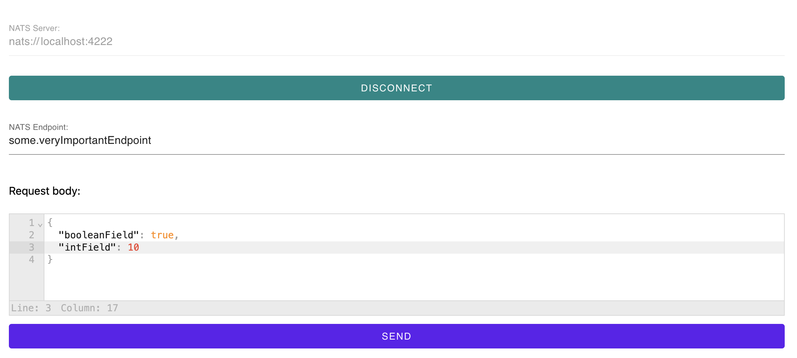

## Simple GUI client for NATS endpoints
Just download, run and use. It's simple!

For now for interacting with another services it only uses msgpack format.

You can get latest apps on the [release page](https://github.com/Ivan-Feofanov/nats-gui-client/releases).

## Screenshot

## Next steps
- Save and use servers and requests history
- Additional message formats

If you have any good ideas you're welcome to [create an issue](https://github.com/Ivan-Feofanov/nats-gui-client/issues).
## License

NATS GUI Client is released under the [MIT License](https://opensource.org/licenses/MIT).